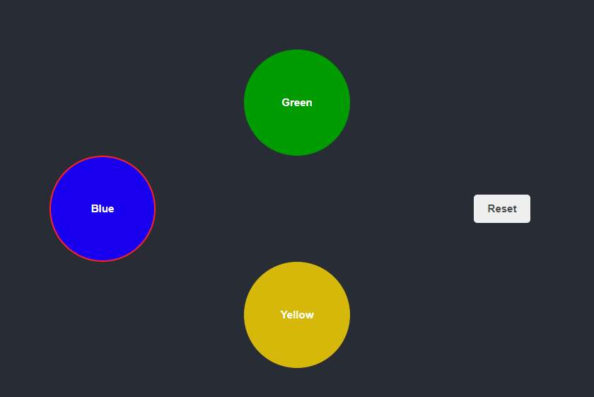

## Installation instructions

To install this project, do the following in project folder:

### For client

1. Install NPM dependencies with `npm i`
2. Run the client by `npm run start`

The client application should be running at `http://localhost:3000`.

### For server

1. Navigate to server folder with terminal `cd .\server\`
2. Install NPM dependencies with `npm i`
3. Run the server by `npm run start` or can use `npm run server` direct from project folder.
   The server application should be running at `http://localhost:5050`.
